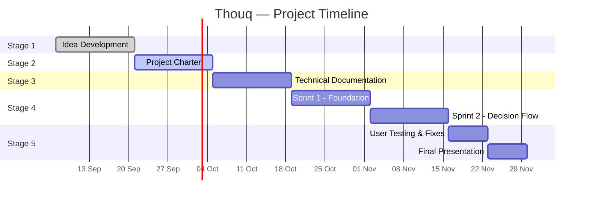

# Thouq (ذوق)

**A group meal decision app.** Participants join a shared session with a code, enter their preferences and constraints, and Thouq recommends three restaurants for the group to vote on.

**Team:** Shatha Alanzi, Asem Alhubaishi, Hassan Alhuzali, Fahad Almidaj
**Stack:** React Native (mobile), REST API, relational database
**Status:** Stage 2 — Project Charter

---

## Table of Contents

- [1. Purpose and Objectives](#1-purpose-and-objectives)
- [2. Problem Statement](#2-problem-statement)
- [3. Stakeholders](#3-stakeholders)
- [4. User Segments](#4-user-segments)
- [5. Team and Roles](#5-team-and-roles)
- [6. Scope (MoSCoW)](#6-scope-moscow)
- [7. Risks and Mitigation](#7-risks-and-mitigation)
- [8. High-Level Plan](#8-high-level-plan)
- [9. Success Criteria](#9-success-criteria)
- [10. Open Items](#10-open-items)

---

## 1. Purpose and Objectives

### Purpose

Thouq exists to remove the friction from group dining decisions. Choosing where a group eats usually happens in a long chat thread where preferences, budgets, and dietary restrictions get lost, quieter members get overridden, and plans often collapse before anyone commits. Thouq collects everyone's input through a single shared session and turns it into a short, explained set of options the group can vote on.

### Objectives (SMART)

**Objective 1 — Reduce the effort of stating what you want**
Build a session flow where any participant can join with a shared code and submit their budget, cuisine preferences, and dietary constraints in under one minute, with no account and no sign-in, by the end of the MVP phase.

**Objective 2 — Deliver recommendations the whole group can accept**
Build a recommendation engine that strictly excludes any restaurant violating a stated allergy or dietary constraint, then ranks the remainder by score, returning exactly three options — each with a written reason for why it was recommended — by the end of the MVP phase.

**Objective 3 — Speed up the group's decision**
Enable in-app voting and confirmation, and verify through testing with at least five real groups during the closure phase that the group reaches a decision faster than their usual chat-based process.

> Each objective is specific, has a measurable pass condition (under one minute; zero constraint violations and exactly three explained options; five tested groups), is achievable with the team's current skills, directly serves the stated purpose, and is bounded by a project phase.

---

## 2. Problem Statement

The information needed to choose a restaurant for a group — who is coming, what they can spend, what they can't eat, where they're coming from — is scattered across a chat thread and never assembled in one place.

Today the process is manual. Someone sends a few names or a map link, a couple of people object, most stay silent, and the decision either defaults to whoever pushes hardest or gets postponed. The cost shows up as time lost to an open-ended thread, plans that collapse before anyone books, and participants with allergies or dietary restrictions who have to re-explain themselves every single time.

Saudi Arabia has roughly 70,000 restaurants, around 18,000 of them in Riyadh. The abundance of options is exactly what makes the group decision hard: plenty of choice, no mechanism to narrow it down together.

---

## 3. Stakeholders

| Stakeholder | Type | Interest | Involvement |
| --- | --- | --- | --- |
| Development team (4 members) | Internal | Deliver a working MVP and complete the portfolio project | Build, test, and document the product |
| Mentors and tutors | Internal | Verify standards compliance and review progress | Periodic review, feedback, approval of scope, QA review |
| Session organizers | External — primary user | Settle the group's choice quickly | Create sessions, share the code; main source of usability feedback |
| Participants | External — primary user | State preferences without a long discussion | Join sessions, submit preferences, vote |
| Participants with dietary constraints | External — key segment | Options that respect their constraints every time | Validate that strict exclusion never fails |
| Restaurant data source | External — dependency | — | Supplies the restaurant records the engine depends on |
| Restaurants and cafés | External — future partner | Reach groups at the moment of decision | Not involved in the MVP; potential partners in a later phase |

---

## 4. User Segments

| Segment | Description | What they need from Thouq |
| --- | --- | --- |
| **The organizer** | Starts the outing and carries the coordination burden | A fast way to collect everyone's input and close the decision |
| **The participant** | Has preferences and constraints but rarely states them in a group chat | A low-effort way to be heard without arguing for it |
| **The institutional organizer** | Arranges a meal for a team, department, or event group | A defensible choice that accounts for a larger, more varied group |

---

## 5. Team and Roles

| Member | Primary role | Responsibilities |
| --- | --- | --- |
| **Shatha Alanzi** | Project Manager / Front-End (React Native) / UI-UX | Sprint planning, board and progress tracking, mentor communication, screen design and user flows, front-end implementation |
| **Asem Alhubaishi** | API / Back-End | API design and implementation, session and code logic, recommendation engine, technical decisions on the server side |
| **Hassan Alhuzali** | Database / QA | Data model and schema, restaurant dataset preparation, test plans and test cases, bug tracking and verification |
| **Fahad Almidaj** | Front-End (React Native) | Screen implementation, join-and-vote flows, API integration, loading and error states |

**Accountability:** each area has one owner who makes the final call within it. Cross-area technical decisions are settled by the API owner; scope and timeline decisions by the Project Manager. Every pull request needs at least one reviewer from outside the author's area.

**Shared learning:** each member owns at least one feature end to end — data model, API, screen, test — so no one finishes the project having touched only one layer. Pair sessions are used when someone works outside their primary area, and no part of the system is understood by only one person.

---

## 6. Scope (MoSCoW)

### Must Have — the MVP is not complete without these

- Session with a shareable code — no accounts, no sign-in
- Entry of preferences, constraints, and allergies for each participant
- Recommendation engine: strict exclusion first, then ranking by score
- A written reason displayed for each recommendation
- Three recommendations and group voting
- Restaurant database tagged with cuisine type, constraints, and price range

### Should Have — valuable, included if time allows

- Restaurant photos
- Handling incomplete responses, with a visible count of how many participants have responded
- Session expiry

### Could Have — desirable, only after everything above is done

- User ratings and reviews

### Won't Have (this release) — explicitly out of scope

- Reservations and restaurant-side integration
- AI-based personalization
- Publishing to the app stores

> The last group is deliberately named **Won't Have**, not "Would Have". In MoSCoW it records what the team has agreed *not* to build in this release, which is what makes it useful as a defence against scope creep. Reservations and AI stay here for the MVP; both remain on the product roadmap for later phases.

---

## 7. Risks and Mitigation

### Technical

| Risk | Likelihood | Impact | Mitigation | Owner |
| --- | --- | --- | --- | --- |
| Restaurant data is hard to source, incomplete, or outdated | High | High | Start with a manually curated dataset for one district of Riyadh; prepare it during the documentation phase, not during development | Hassan |
| Recommendation engine produces poor results when preferences conflict | Medium | High | Separate strict exclusions from weighted scoring; write test cases for conflict scenarios before building; display the reason per recommendation so bad output is visible immediately | Asem |
| Limited experience with parts of the stack | High | Medium | Choose tools most of the team already knows, allocate learning time in the documentation phase, and pair with the more experienced member | Asem |
| Front-end and API integration problems | Medium | Medium | Agree and document the API contract before implementation; build screens against mock data until endpoints are ready | Shatha / Fahad |
| Late merges and code conflicts | Medium | Medium | Small short-lived branches, near-daily merges, protected main branch with required review | Fahad |
| Deployment or build problems surface late | Medium | High | Produce a runnable build in the first sprint, even if nearly empty, rather than waiting until the end | Fahad |

### Schedule

| Risk | Likelihood | Impact | Mitigation | Owner |
| --- | --- | --- | --- | --- |
| Scope creep — reservations, AI, extra features pulled forward | High | High | The Won't Have list is fixed for this release; new ideas go to the roadmap, never into the current sprint | Shatha |
| Tasks take longer than estimated | High | Medium | Break work into items of two days or less, review progress weekly, and decide in advance what gets dropped first | Shatha |
| Other coursework deadlines compete for time | High | Medium | Map known deadlines in advance and lighten the sprint in those weeks | Shatha |
| User testing gets squeezed at the end | Medium | High | Recruit the five test groups during development, and run one early test at the end of sprint 1 | Hassan |

### Team

| Risk | Likelihood | Impact | Mitigation | Owner |
| --- | --- | --- | --- | --- |
| Uneven contribution between members | Medium | High | Clear task ownership on the board, transparent weekly progress review, and early discussion of any imbalance | Shatha |
| A member is absent or unavailable for a period | Medium | High | No part of the system known to only one person; document as work proceeds | All |
| Disagreement on technical or design decisions | Medium | Medium | Discuss first, then the area owner decides, and the reasoning is written down | Asem |

### Product

| Risk | Likelihood | Impact | Mitigation | Owner |
| --- | --- | --- | --- | --- |
| Invited participants don't respond | Medium | High | Keep the join flow extremely short with no sign-in, and produce useful recommendations from partial responses | Shatha |
| Groups keep using their chat app instead | Medium | High | Test early with real groups; position the session code as something shared *inside* the existing chat, not a replacement for it | Hassan |
| A recommendation violates a stated allergy | Low | High | Treat exclusions as hard filters that ranking can never override, with dedicated automated tests for this case | Asem |

### Top three to watch from week one

1. **Restaurant data** — without it there is no product.
2. **Scope creep** — reservations and AI are the most tempting distractions.
3. **Task slippage** — four development weeks cannot absorb accumulated delay.

---

## 8. High-Level Plan

Dates assume a 12-week project starting 7 September 2026. Adjust to the official schedule.

| Stage | Weeks | Dates | Status |
| --- | --- | --- | --- |
| 1. Idea Development | 1–2 | 7 – 20 Sep | ✅ Completed |
| 2. Project Charter | 3–4 | 21 Sep – 4 Oct | 🔄 Current |
| 3. Technical Documentation | 5–6 | 5 – 18 Oct | ⏳ Upcoming |
| 4. MVP Development | 7–10 | 19 Oct – 15 Nov | ⏳ Upcoming |
| 5. Project Closure | 11–12 | 16 – 29 Nov | ⏳ Upcoming |

### Milestones and deliverables

**Stage 1 — Idea Development** ✅
Team formed and roles assigned; four ideas explored and three rejected with documented reasoning.
**Milestone:** Thouq approved as the MVP concept; Stage 1 report submitted.

**Stage 2 — Project Charter** 🔄
Purpose and SMART objectives defined; stakeholders and roles documented; scope fixed with MoSCoW; risks identified with mitigation and owners.
**Milestone:** Project charter submitted and approved by the mentor.

**Stage 3 — Technical Documentation**
User stories and flows; wireframes and screen designs; system architecture and stack decisions; database schema and API contract; restaurant dataset prepared for the target district.
**Milestone:** Technical documentation submitted; repository, branch protection, and CI in place.

**Stage 4 — MVP Development**

*Sprint 1 (weeks 7–8) — Foundation*
Database and core API; session creation with shareable code; preference entry form; runnable build deployed.
**Milestone:** A user can create a session, share the code, and collect participants' preferences.

*Sprint 2 (weeks 9–10) — Decision flow*
Recommendation engine with strict exclusion and scoring; written reason per recommendation; three options, voting, and confirmation.
**Milestone:** The full path works end to end, from session creation to a confirmed restaurant.

**Stage 5 — Project Closure**
Testing with five real groups and measurement of decision time; bug fixes; documentation and README finalized; final presentation prepared.
**Milestone:** Final presentation delivered and project submitted.

### Timeline

---

## 9. Success Criteria

| Criterion | Target |
| --- | --- |
| Functional completeness | A group can go from creating a session to a confirmed restaurant without leaving the app |
| Join effort | A participant completes the join-and-submit flow in under one minute, without an account |
| Constraint accuracy | Zero recommendations violating a stated allergy or dietary constraint |
| Explainability | Every recommendation displays a written reason |
| Participation | A majority of joined participants submit their preferences |
| Decision speed | Measurably faster than the group's usual chat-based process, across five tested groups |

---

## 10. Open Items

- Confirm the official project start and submission dates and update the timeline accordingly.
- Decide the restaurant data source: curated dataset or external API, and the target district in Riyadh.
- Define the scoring formula for ranking, and the tie-breaking rule when scores are equal.
- Establish a baseline for decision time before development starts — without it, "faster" cannot be proven.
- Decide what happens when no restaurant satisfies all strict exclusions.
_To be defined._

—-

