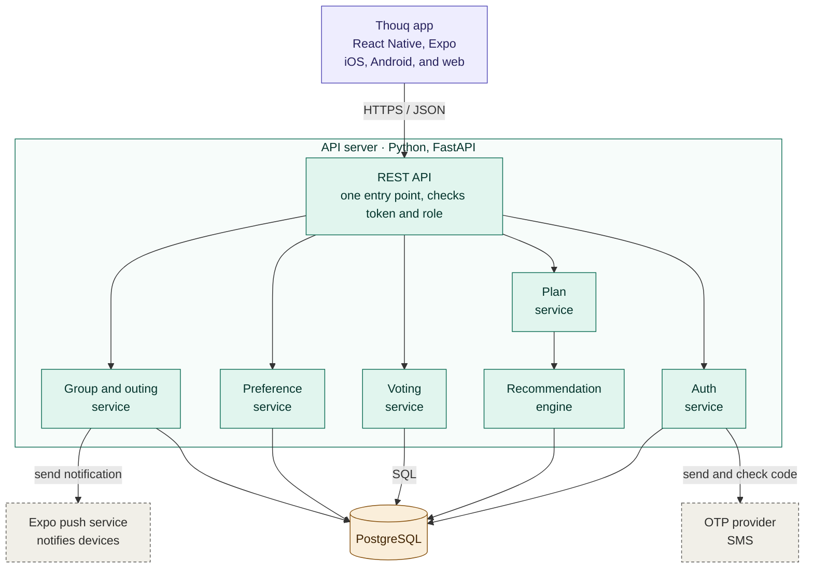
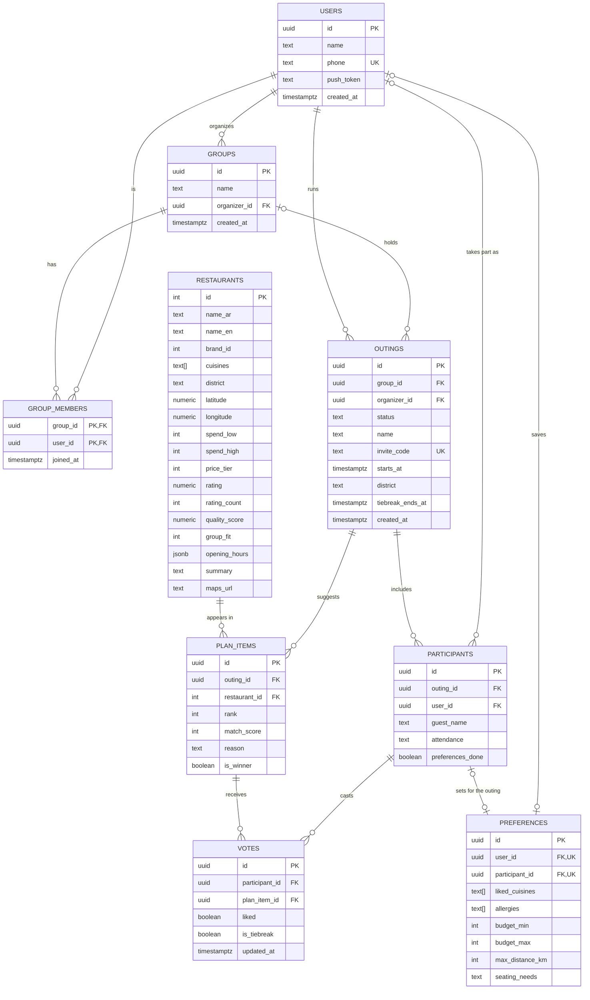
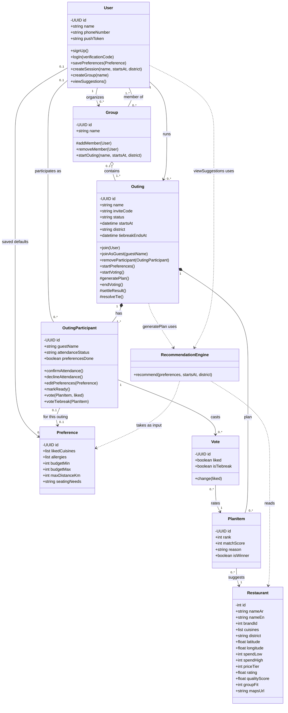
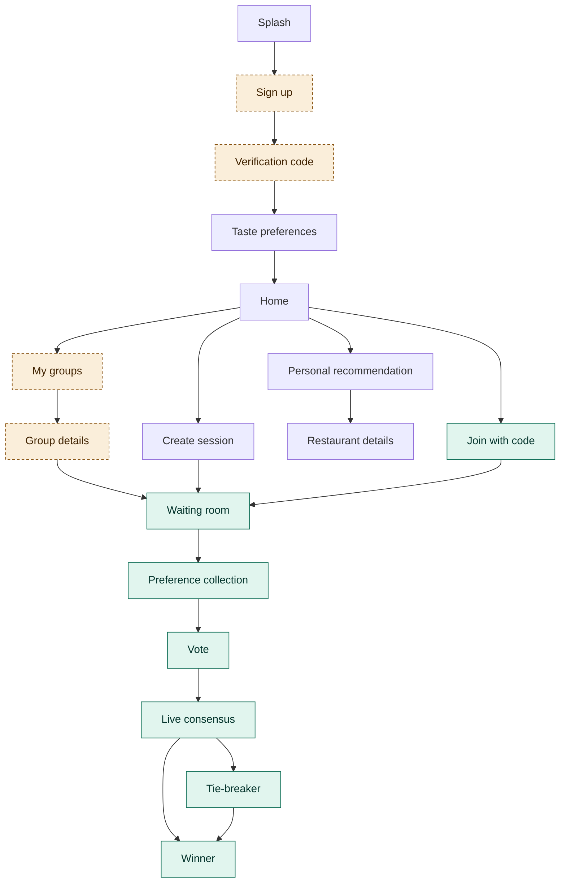
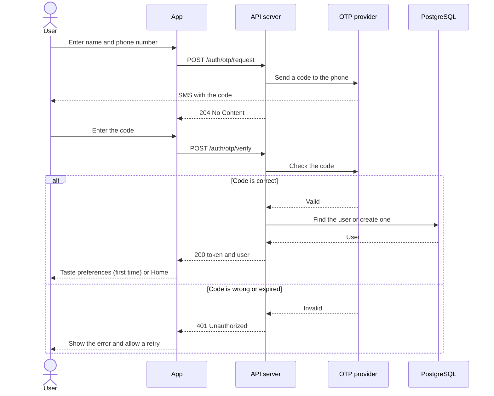
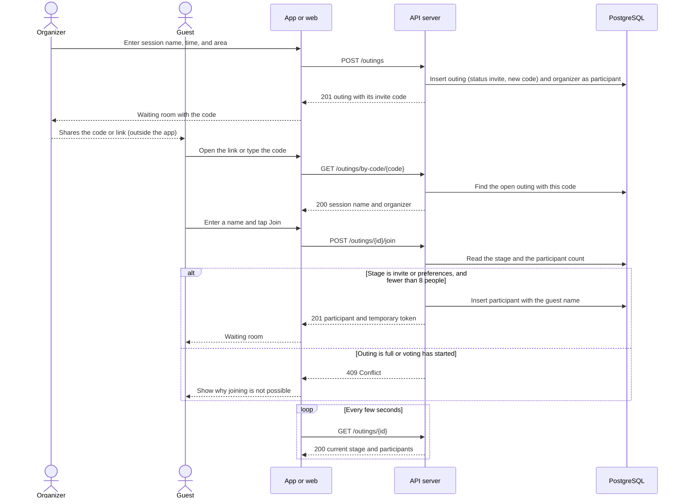
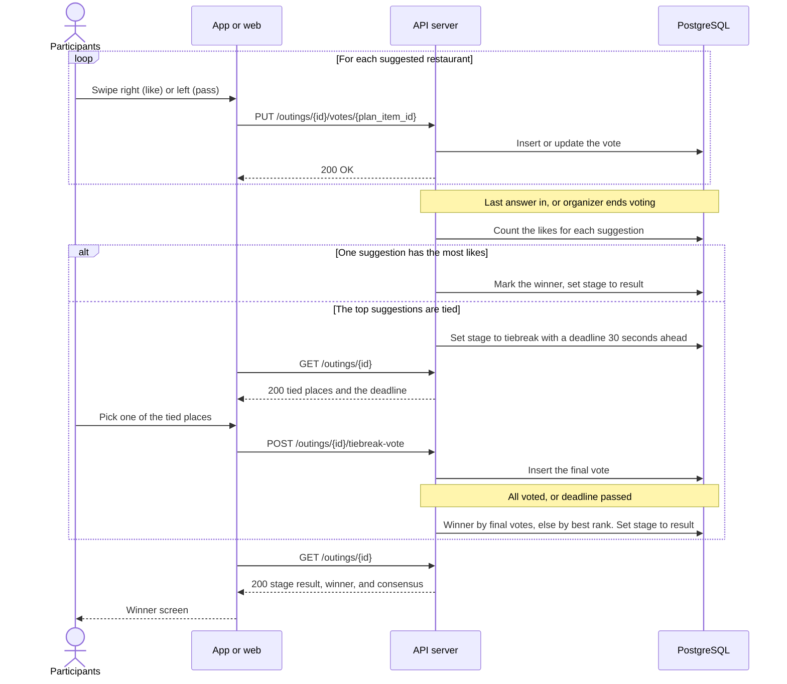

# Thouq · Technical Documentation

Portfolio Project · Stage 3

| | |
|---|---|
| Project | Thouq (ذوق), a group dining planner |
| Team | Shatha Alanzi, Asim Alhubaishi, Hassan Alhuzali, Fahad Almidaj |

## Contents

0. [User stories and mockups](#0-user-stories-and-mockups)
1. [System architecture](#1-system-architecture)
2. [Components, classes, and database design](#2-components-classes-and-database-design)
3. [Sequence diagrams](#3-sequence-diagrams)

---

## 0. User stories and mockups

### Terms

| Term | Meaning |
|---|---|
| Group | A saved set of people who go out together. It stays after an outing ends. |
| Outing | One occasion: a name, a time, a meeting area, and the people taking part. Each outing has its own preferences, plan, vote, and result. An outing is either a one-off session or one of a saved group's outings. |
| Session | A one-off outing that does not belong to a saved group. |
| Plan | The list of suggested restaurants for one outing. |
| Registered user | A person with an account (name and phone number). |
| Organizer | The registered user who created the session or the group and runs it. |
| Member | A registered user who joined a group. Membership is permanent. |
| Guest | A person without an account who joins one outing with a name only. |
| Participant | An organizer, member, or guest taking part in an outing. |

### Key decisions

The stories below are built on these decisions.

- **Accounts:** Users sign up with their name and phone number and log in with a one-time verification code. There are no passwords.
- **Two ways to decide:** A one-off session is created directly, shared by its code, and keeps no member list afterwards. A saved group keeps its members, and its organizer can start new outings in it. Both go through the same four stages.
- **Saved groups:** A member joins a group once. The organizer can start a new outing without re-inviting members.
- **First outing:** Creating a group starts its first outing automatically. The plan, the vote, and the invite link belong to the outing, not to the group.
- **New outings and attendance:** When the organizer starts a new outing in a saved group, every member, including the organizer, receives a notification and confirms whether they are coming. Only those who confirm take part in the plan and the vote. A member who does not respond is not included, but can still confirm until voting starts. There are no automatic reminders in the first version.
- **Invite link:** One link per outing, carrying a four-character invite code of letters and digits. The link opens the app if it is installed; otherwise it opens a web page where a guest can join without installing anything. The code can also be typed in the app. A registered user who joins a group's outing becomes a permanent member of that group; in a one-off session nobody becomes a member. A guest joins that outing only. Joining from the link counts as confirming attendance.
- **Web version:** Built from the same code as the mobile app with Expo, and limited to the guest path: joining, entering preferences, viewing the plan, voting, and seeing the result. Registered users use the mobile app.
- **Guests:** Guests have no account, join with a name only, and need a new link for each outing unless they sign up.
- **Size:** Up to 8 people, including the organizer, in a session or a group. When it is full, a message says so.
- **Language and appearance:** The first version is in Arabic with a light theme. English and a dark theme are designed but left for a later version.
- **Preferences:** For each outing a participant sets liked cuisines, a budget range, a maximum distance, and any allergies, restrictions, or seating needs. Editing them for an outing is optional, applies to that outing only, and does not change the account. There is no list of rejected cuisines: a participant rejects a place by passing on it during the vote.
- **Allergies:** Shown to the group as one combined warning for the outing, without the names of the people concerned, on the voting and result screens. The app does not filter restaurants by allergens and does not guarantee that a restaurant is safe. The preferences screen tells the participant that the allergy will be shown this way before they enter it.
- **Privacy of answers:** A participant's cuisines, budget, and distance limit are not shown to other participants. They are used only to build the plan.
- **Outing settings:** When starting an outing, the organizer gives it a name and sets the time and the meeting area. These apply to the whole group. The time decides which meal the restaurants must suit, and distances are measured from the centre of the meeting area, so no participant has to share a location.
- **Distance:** Restaurant cards show the straight-line distance from the meeting area, not travel time.
- **Restaurant cards:** A card shows an illustration for the restaurant's cuisine instead of a photo, because the restaurant data has no photos. It also shows the cuisine, price level, distance, and a match percentage, which is the recommendation engine's score for that place from 0 to 100. Rating and opening hours appear only when the data has them.
- **Stages:** An outing moves through four stages, shown at the top of every screen: invite, preferences, vote, and result. The organizer starts the preferences stage. People can still join during the invite and preferences stages; joining closes when voting starts.
- **Plan:** Generated automatically when the last participant marks their preferences as ready. The organizer can start voting earlier; a participant who has not entered preferences is left out of the plan's calculation but can still vote.
- **Notifications:** Push notifications are sent when a new outing starts in a group, when voting starts, and when the result is announced. The same information is shown inside the app for anyone who has notifications turned off.
- **Voting:** Each participant goes through the suggested restaurants one card at a time and gives each a like or a pass. An answer can be changed until voting ends. Voting ends on its own when every participant has answered every card; the organizer can end it earlier, and the answers given so far are counted. The restaurant liked by the most participants wins, and the result shows the share of participants who liked it. In a tie, every participant casts one final vote between the tied restaurants within 30 seconds, and the result stays hidden until the end. If the final vote is also tied, or the time runs out with no majority, the restaurant ranked highest by the recommendation engine wins.
- **Recommendation:** A rule-based algorithm inside the back-end. It filters places by the outing's time and meeting area, by the lowest budget ceiling in the group, and by the shortest distance limit in the group. It then scores each place by how well its cuisine matches every participant and returns a short, varied list.
- **Restaurant data:** The team's Riyadh restaurants dataset (version 1, prepared 29 September 2026). It is a snapshot and does not update automatically. The app suggests only places marked as open.

### Prioritized user stories

Stories are prioritized with the MoSCoW method: Must Have, Should Have, Could Have, and Won't Have.

#### Must Have

20 stories the app cannot work without.

| # | Title | Role | User story |
|---|---|---|---|
| 1 | Sign up | New user | As a new user, I want to sign up with my name and phone number, so that I can create or join outings and keep my preferences saved. |
| 2 | Log in | Registered user | As a registered user, I want to log in with a verification code sent to my phone, so that I can access my account without a password. |
| 3 | Save preferences | Registered user | As a registered user, I want to save my taste preferences and allergies, so that I don't have to re-enter them every time. |
| 4 | Create a session | Organizer | As an organizer, I want to create a session with a name, a time, and a meeting area, so that I can bring people together to decide where to eat. |
| 5 | Invite | Organizer | As an organizer, I want to share the session's code or link, so that people can join quickly. |
| 6 | Join | Registered user | As a registered user, I want to join an outing with its code or link, and become a member when it belongs to a group, so that I can take part in the decision. |
| 7 | Join as a guest | Guest | As a guest, I want to join an outing from the link using only my name, without an account, so that I can take part quickly. |
| 8 | Outing preferences | Organizer, Member | As an organizer or member, I want to see my saved preferences and edit them for this outing if needed, so that they fit the outing without changing my account. |
| 9 | Guest preferences | Guest | As a guest, I want to enter my preferences and allergies for this outing, so that the group takes them into account. |
| 10 | Run the stages | Organizer | As an organizer, I want to see who has joined and who is ready, and to start the preferences round or the vote without waiting for everyone, so that the group keeps moving. |
| 11 | Get the plan | Participant | As a participant, I want restaurant suggestions that match everyone's preferences to appear once everyone is ready, with the group's allergies shown as a warning, so that we can choose with everyone's needs in mind. |
| 12 | Vote | Participant | As a participant, I want to go through the suggested restaurants, like or pass on each one, and change my answer until voting ends, so that my opinion counts. |
| 13 | End voting early | Organizer | As an organizer, I want to end voting before everyone has finished, so that one person's delay does not hold up the group. |
| 14 | Tie-break | Participant | As a participant, I want to cast one final vote when the top restaurants are tied, so that the group settles the tie fairly. |
| 15 | See the result | Participant | As a participant, I want to see the winning restaurant as soon as voting ends, so that I know where we are going. |
| 16 | Create a group | Organizer | As an organizer, I want to create and name a group, so that the same people can decide together again without being re-invited. |
| 17 | My groups | Organizer, Member | As an organizer or member, I want to see my saved groups and their outings, so that I can return to them easily. |
| 18 | Start a new outing | Organizer | As an organizer, I want to start a new outing in my saved group, so that we can decide again without re-inviting everyone. |
| 19 | Confirm attendance | Organizer, Member | As an organizer or member, I want to be told when a new outing starts in my group and confirm whether I am coming before voting starts, so that the plan and the vote include only the people attending. |
| 20 | Attendance responses | Organizer | As an organizer, I want to see who has confirmed, who has declined, and who has not responded, so that I know who is coming before voting starts. |

#### Should Have

6 stories that add real value, but the app works without them.

| # | Title | Role | User story |
|---|---|---|---|
| 21 | Recommendation reason | Participant | As a participant, I want to open a suggested restaurant and see why it was recommended, so that I can trust the suggestion. |
| 22 | Browse and search | Registered user | As a registered user, I want to browse restaurants and search them by name, so that I can see the available options. |
| 23 | Personal recommendation | Registered user | As a registered user, I want suggestions based on my saved preferences, my budget, and a distance from where I am, so that I know what suits me when I am deciding alone. |
| 24 | Remove people | Organizer | As an organizer, I want to remove a member or guest, so that only the intended people stay in the outing or the group. |
| 25 | Member notifications | Member | As a member, I want a notification when voting starts and when the result is announced, so that I don't miss either. |
| 26 | Restaurant location | Participant | As a participant, I want to open the winning restaurant's location in Google Maps, so that I can get there easily. |

#### Could Have

6 stories to add if time allows.

| # | Title | Role | User story |
|---|---|---|---|
| 27 | Guest notifications | Guest | As a guest, I want to receive a notification when voting starts or the result is announced while the app is closed, so that I don't miss it. |
| 28 | Sign up after the outing | Guest | As a guest, I want to create an account after the outing, so that I keep my history and can be added to a group. |
| 29 | Save restaurants | Registered user | As a registered user, I want to save a restaurant to a list, so that I can find it again. |
| 30 | Taste summary | Registered user | As a registered user, I want to see how many choices I have made and which cuisines I like most, so that I understand my own taste. |
| 31 | Mood | Registered user | As a registered user, I want to pick a mood (something new, something comforting, a hearty feast, or light and healthy) for a personal recommendation, so that the suggestions fit how I feel. |
| 32 | Tourist guide | Visitor | As a visitor, I want a simple guide to Saudi dishes and nearby places that serve them, so that I know what to try. In Arabic in the first version. |

#### Won't Have

Out of scope for the first version.

- Ordering food or delivery through the app.
- Restaurant reservations.
- Payment options for an outing (splitting the bill, a draw, or one person covering it). Planned for a later version.
- Processing payments or transferring money through the app.
- Filtering restaurants by allergens or guaranteeing that a restaurant is safe.
- Restaurant photos from an external source such as Google Places, and photo galleries. Planned for a later version.
- Travel time to a restaurant.
- English and a dark theme. Designed, and planned for a later version.
- Searching for a dish.
- A recommendation engine that learns from past choices.
- Cities other than Riyadh.

### Mockups

The screens are designed in Figma: [Thouq design file](https://www.figma.com/design/w1p7AhzqMQEKJsgcAueoZl/Thouq?node-id=0-1). The first version is built in Arabic with the light theme; the English and dark variants in the file are for a later version.

Exported images go in `Docs/mockups/`. Until they are exported, the table names each frame in the Figma file.

| Screen | Frame in Figma | Stories | Status |
|---|---|---|---|
| Splash | Splash — Arabic v2 | | Designed |
| Sign up | | 1 | To design |
| Verification code | | 1, 2 | To design |
| Taste preferences | Onboarding — Taste preferences | 3 | Designed |
| Home | Home — Arabic light | 22, 23 | Designed |
| Create session | Group — Create session | 4 | Designed |
| Join with code | Group — Join with code | 6, 7 | Designed |
| Waiting room | Group lobby — Arabic | 5, 10 | Designed |
| Preference collection | Group — Preference collection | 8, 9 | Designed; needs the organizer's "Start voting now" button, a seating-needs field, and the allergy sentence |
| Vote | Group vote — Arabic light | 11, 12 | Designed; needs the allergy banner and a cuisine illustration in place of the photo |
| Live consensus | Group — Live consensus | 12, 13 | Designed; needs the organizer's "End voting now" button |
| Tie-breaker | Group — Tie breaker | 14 | Designed |
| Winner | Group winner — Arabic light | 15, 26 | Designed; needs the allergy banner |
| Restaurant details | Restaurant details — Arabic light | 21, 26 | Designed; the photo gallery is replaced by one illustration |
| Personal recommendation | Personal recommendation — Mood and budget | 23, 31 | Designed |
| Saved and profile | Saved and profile — Arabic | 29, 30 | Designed; the accuracy percentage is removed |
| My groups | | 17 | To design |
| Group details | | 16, 18, 20, 24 | To design |
| Attendance request | | 19 | To design |
| Tourist guide (three screens) | Tourist — Explore Saudi food, Saudi dish guide, Restaurant guidance | 32 | Designed; Could Have |

---

## 1. System architecture

Thouq follows a client-server architecture with three layers: a client app (mobile, with a web version for guests), a REST API, and a relational database. External services are used only for sending the login code and for push notifications.

Read the diagram from top to bottom: the app sends every request to the REST API, the API passes it to one service, and the services use the database and the two external services.

- Colours mark the layers: purple for the client, green for the API server, amber for the data layer, and grey with a dashed border for external services.
- Every arrow is a request, and the label says what travels.
- The services are modules of one application, not separately deployed servers.
- All services read and write PostgreSQL. The plan service does so through the recommendation engine and directly when it saves the plan.
- The auth service is the only one that calls the OTP provider.
- The group and outing service sends a notification when a new outing starts in a group. The plan service and the voting service do the same when voting starts and when the result is announced; those two arrows are left out to keep the diagram clear.
- The app also opens the winning restaurant's location in Google Maps from a saved link, without going through the server.

### Components

| Component | Layer | Technology | Responsibility |
|---|---|---|---|
| Thouq app | Client | React Native with Expo: iOS and Android apps, and a web version for guests from the same code | All screens; sends requests to the API and shows the results. Holds no shared data and makes no decisions. Opens the winning restaurant's location in Google Maps from a saved link |
| REST API | API server | Python, FastAPI | The only entry point. Checks the token and the user's role, then passes the request to the right service |
| Auth service | API server | Python | Sign-up, login codes, tokens for registered users, and temporary tokens for guests. The only code that talks to the OTP provider |
| Group and outing service | API server | Python | Creating groups and outings, invite codes, joining as a member or guest, attendance, removing people, and moving the outing through its stages |
| Preference service | API server | Python | Saved preferences and allergies on the account, and the copy edited for one outing |
| Plan service | API server | Python | Generating the plan when everyone is ready or the organizer starts voting, and storing it. Also serves personal recommendations and restaurant search |
| Recommendation engine | API server | Python | Called by the plan service. Filters and ranks restaurants for an outing and returns a short list with a reason for each place |
| Voting service | API server | Python | Recording likes and passes, ending voting, settling ties, and announcing the winner |
| Database | Data | PostgreSQL | Users, groups, outings, preferences, plans, votes, and the restaurants table |
| OTP provider | External | Chosen before final testing (candidates: Twilio, Authentica) | Sends the verification code by SMS and checks it |
| Push notifications | External | Expo push notification service | Attendance and plan notifications. The back-end sends the message and the recipients' device tokens to Expo, which delivers it to Android and iOS devices |

The restaurants table is filled once from the team's dataset by an import script. The app does not call any external restaurant service at run time.

### Data flow

The app never talks to the database or to the OTP provider directly. Every request goes to the REST API as JSON over HTTPS, and the back-end is the only component that reads and writes the database. The single exception is opening a map link, which needs no data from the server.

**Example: generating the plan**

1. The last participant taps "Ready to vote". The app sends the request to the REST API with the participant's token.
2. The API checks the token, confirms that the sender is a participant in this outing, and passes the request to the preference service, which marks the participant as ready.
3. Everyone is now ready, so the plan service calls the recommendation engine, which loads the participants' preferences from PostgreSQL.
4. The engine queries the restaurants table, filters and ranks the places, and returns a short list with a reason for each place.
5. The plan service saves the list as the outing's plan and moves the outing to the voting stage.
6. Every participant's app receives the new stage and the plan the next time it asks the API for the outing's state, and shows the first card.

**Live updates:** the app asks the API for the current state of the outing every few seconds while a participant is on the plan or voting screen. This keeps the plan and the vote counts up to date without a permanent connection. The same request drives the tie-break timer: the API compares the current time with the deadline each time the state is requested and settles the tie once it has passed, so no background process is needed.

**Joining:** every outing has a short invite code, and the invite link carries that code. If the app is installed, the link opens it on the join screen; otherwise it opens the web version in the browser. The code can also be typed in the app. A registered user joins as a member. A guest enters a name only and receives a temporary token that is valid for that outing, which the API accepts for entering preferences, viewing the plan, and voting. The mobile app and the web version call the same API in the same way.

**Notifications:**

1. After login, the app asks the user for permission, obtains a device token from Expo, and sends it to the API, which stores it with the user.
2. When an event needs a notification, such as a new outing starting in a group, voting starting, or the result being announced, the responsible service collects the tokens of the members concerned and sends one request to the Expo push service.
3. Expo delivers the notification to each device, even if the app is closed. Tapping it opens the app on the relevant outing.

The same information also appears as a card inside the app, so a member who has turned notifications off, or missed one, still sees it when they open the app. Guests on the web version do not receive push notifications; they see updates on the page.

### Scalability and efficiency

- **Separate layers:** the app, the API, and the database can each be changed or moved to a larger server without rewriting the others.
- **Replaceable parts:** the recommendation engine is called only by the plan service, and the OTP provider only by the auth service, so either can be improved or swapped without changing the app or the other services.
- **Filtering in the database:** restaurants are filtered with SQL queries on indexed columns, so the back-end never loads the full table into memory.
- **Local restaurant data:** suggestions do not depend on a call to an external service, which keeps response time short and predictable.
- **Stored plans:** a plan is generated once per outing and saved, not recalculated every time a participant opens it.

---

## 2. Components, classes, and database design

### Database design

The database is relational (PostgreSQL) and has nine tables. Four ideas shape it:

- **People and occasions are separate.** A group holds its members. An outing holds everything that changes from one occasion to the next. An outing can also stand alone, with no group, as a one-off session.
- **`participants` is the central table.** It has one row per person per outing, for members and guests alike, and carries that person's attendance. Their preferences for the outing and their votes point to this row.
- **Preferences have one table for two uses.** A row in `preferences` belongs either to an account (saved defaults) or to a participant (one outing). Joining an outing copies the saved row into a new one, so editing it never changes the account.
- **A plan is not a table of its own.** The plan of an outing is the set of its `plan_items` rows.

How to read the lines: `||` means exactly one, `o{` means zero or many, and `o|` or `|o` means zero or one. For example, one outing includes many participants, one participant casts many votes, one for each suggested restaurant, and a participant is linked to at most one user, because a guest has no account. All ids are UUIDs, except in `restaurants`, which keeps the integer ids of the dataset.

#### `users`

One row per registered account. Guests have no row here.

| Column | Type | Required | Notes |
|---|---|---|---|
| id | uuid | yes | Primary key |
| name | text | yes | |
| phone | text | yes | Unique. Used to log in |
| push_token | text | no | Device token for push notifications |
| created_at | timestamptz | yes | |

#### `groups`

One row per saved group.

| Column | Type | Required | Notes |
|---|---|---|---|
| id | uuid | yes | Primary key |
| name | text | yes | |
| organizer_id | uuid | yes | Foreign key to `users` |
| created_at | timestamptz | yes | |

#### `group_members`

One row per registered user in a group, including the organizer. This table exists because a user can be in many groups and a group has many users.

| Column | Type | Required | Notes |
|---|---|---|---|
| group_id | uuid | yes | Foreign key to `groups`. Part of the primary key |
| user_id | uuid | yes | Foreign key to `users`. Part of the primary key |
| joined_at | timestamptz | yes | |

#### `outings`

One row per occasion, whether a one-off session or one of a group's outings.

| Column | Type | Required | Notes |
|---|---|---|---|
| id | uuid | yes | Primary key |
| group_id | uuid | no | Foreign key to `groups`. Empty for a one-off session |
| organizer_id | uuid | yes | Foreign key to `users`: the person who runs this outing |
| name | text | yes | Given by the organizer, for example "Thursday dinner" |
| status | text | yes | `invite`, `preferences`, `voting`, `tiebreak`, or `result`. The first three and the last match the four stages shown in the app |
| invite_code | text | yes | Four letters and digits. Unique among outings that are still open. Carried by the invite link |
| starts_at | timestamptz | yes | Date and time set by the organizer. The meal (breakfast, lunch, afternoon, dinner, late night) is worked out from it and matched against the restaurants' `meal_fit` columns |
| district | text | yes | Meeting area chosen by the organizer. Distances are measured from its centre, taken as the average position of the restaurants in that district, so no separate districts table is needed |
| tiebreak_ends_at | timestamptz | no | Set when a tie-break starts: the moment the 30 seconds end |
| created_at | timestamptz | yes | |

Outing status:

| Status | Meaning | What is allowed |
|---|---|---|
| `invite` | The waiting room: people join with the code | Join, confirm attendance; the organizer starts the preferences stage |
| `preferences` | Each participant enters preferences and marks them ready | Join, confirm attendance, edit preferences, mark ready; the organizer can start voting early |
| `voting` | The plan exists and voting is open | Like or pass on each suggestion, change an answer; the organizer can end voting early |
| `tiebreak` | The top places are tied and a final vote is running | Each participant picks one of the tied places until `tiebreak_ends_at` |
| `result` | Voting is over and the winner is known | Everyone sees the result |

#### `participants`

One row per person per outing. A member's row points to their account; a guest's row has a name instead.

| Column | Type | Required | Notes |
|---|---|---|---|
| id | uuid | yes | Primary key |
| outing_id | uuid | yes | Foreign key to `outings` |
| user_id | uuid | no | Foreign key to `users`. Empty for a guest |
| guest_name | text | no | Required when `user_id` is empty |
| attendance | text | yes | `pending`, `confirmed`, or `declined`. Joining from the invite link sets it to `confirmed` |
| preferences_done | boolean | yes | True once the participant taps "Ready to vote". The plan is generated when it is true for everyone |

#### `preferences`

One row per set of preferences. The row belongs to an account or to a participant, never both.

| Column | Type | Required | Notes |
|---|---|---|---|
| id | uuid | yes | Primary key |
| user_id | uuid | no | Foreign key to `users`. Unique. Set for saved defaults |
| participant_id | uuid | no | Foreign key to `participants`. Unique. Set for one outing |
| liked_cuisines | text[] | no | Cuisine codes |
| allergies | text[] | no | Shown to the group as a combined warning, without the participant's name |
| budget_min | integer | no | Lower end of the budget range per person in SAR |
| budget_max | integer | no | Upper end of the range. The engine filters on the lowest `budget_max` in the group |
| max_distance_km | integer | no | Farthest the participant will go from the meeting area. The engine uses the shortest limit in the group |
| seating_needs | text | no | For example family seating or a private room. Stored and shown; not yet used by the recommendation engine |

#### `restaurants`

A reduced copy of the team's Riyadh restaurants dataset: open places only, with the fields the recommendation engine needs. It is filled once by an import script and is read-only for the app. The dataset files are not committed to this repository, because its terms do not allow republishing.

| Column | Type | Required | Notes |
|---|---|---|---|
| id | integer | yes | Primary key |
| name_ar | text | yes | |
| name_en | text | no | |
| brand_id | integer | no | Lets the engine return one branch per brand |
| cuisines | text[] | yes | Cuisine codes from the dataset |
| district | text | yes | |
| latitude, longitude | numeric | yes | |
| spend_low, spend_high | integer | yes | Estimated spend per person in SAR |
| price_tier | smallint | yes | 1 to 4. Shown on the card |
| rating | numeric | no | Rating from map listings. Known for about two thirds of places; shown only when present |
| rating_count | integer | no | Number of ratings behind `rating` |
| quality_score | numeric | no | Rating adjusted for the number of reviews |
| group_fit | integer | no | 0 to 10 |
| meal_fit_breakfast … meal_fit_late_night | smallint | no | Five columns, 0 to 3 each. Not drawn in the diagram to keep it compact |
| opening_hours | jsonb | no | Opening periods per weekday. Known for about half of places; shown only when present |
| summary | text | no | Shown on the restaurant details screen |
| maps_url | text | yes | Opened by the app |

#### `plan_items`

One row per restaurant suggested for an outing.

| Column | Type | Required | Notes |
|---|---|---|---|
| id | uuid | yes | Primary key |
| outing_id | uuid | yes | Foreign key to `outings` |
| restaurant_id | integer | yes | Foreign key to `restaurants` |
| rank | integer | yes | Order given by the recommendation engine |
| match_score | integer | yes | The engine's score for this place, 0 to 100. Shown on the card as the match percentage |
| reason | text | yes | Why the place was recommended |
| is_winner | boolean | yes | True for the winner |

#### `votes`

One row per participant per suggested restaurant: that participant's like or pass.

| Column | Type | Required | Notes |
|---|---|---|---|
| id | uuid | yes | Primary key |
| participant_id | uuid | yes | Foreign key to `participants` |
| plan_item_id | uuid | yes | Foreign key to `plan_items` |
| liked | boolean | yes | True for a like, false for a pass |
| is_tiebreak | boolean | yes | True for the final vote cast during a tie-break |
| updated_at | timestamptz | yes | |

The winner is the plan item with the most likes. Consensus is the number of likes for the winner divided by the number of participants who voted. When the top items are tied, the tie-break votes decide; if they are tied too, or the time runs out with no majority, the tied item with the best `rank` wins.

#### Rules

Enforced by the database:

| Rule | How |
|---|---|
| One account per phone number | `users.phone` is unique |
| A user is in a group once | Primary key on (`group_id`, `user_id`) in `group_members` |
| An invite code leads to one outing | `outings.invite_code` is unique among outings that have not reached the result stage |
| A member appears once in an outing | Unique on (`outing_id`, `user_id`) in `participants` |
| A restaurant appears once in a plan | Unique on (`outing_id`, `restaurant_id`) in `plan_items` |
| One saved set per account, one set per participant | `preferences.user_id` and `preferences.participant_id` are each unique |
| A set of preferences has exactly one owner | Check constraint: exactly one of `user_id` and `participant_id` is filled |
| One answer per participant per suggested restaurant, and one more in a tie-break | Unique on (`participant_id`, `plan_item_id`, `is_tiebreak`) in `votes`. Changing an answer updates the row |

Enforced by the API, because they depend on the state of the outing:

- An outing has at most 8 participants.
- A vote is accepted only while the status is `voting`, and only for a plan item of the same outing.
- A tie-break vote is accepted only while the status is `tiebreak`, before `tiebreak_ends_at`, for one of the tied plan items, and once per participant.
- Joining is accepted only while the status is `invite` or `preferences`.
- Only the organizer can start the preferences stage, start voting early, and end voting early.
- A guest's token is valid for one outing only.
- The API never returns one participant's preferences to another. Allergies are returned as a single combined list for the outing, with no names attached.

Indexes on `restaurants.district` and on the spend columns keep the recommendation engine's filters fast.

The Could Have stories would add a little to this design if they are built: a `saved_restaurants` table linking users to restaurants (story 29), a healthy-options column on `restaurants` for the "light and healthy" mood (story 31), and dish tables for the tourist guide (story 32). The taste summary (story 30) needs nothing new, because it is counted from `votes`.

### Back-end classes

The back-end has one class for each table, plus the recommendation engine, which stores nothing. The class diagram shows what each class knows (attributes), what it can do (methods), and how the classes are related.

How to read it: `+` is public, `-` is private, and `#` is internal (called by other back-end code, never directly by a user). A solid line is a lasting relationship, a line with a filled diamond means "is part of" (the part is deleted with the whole), and a dashed arrow means "uses". The numbers on the lines read as in the ER diagram: `1` is exactly one, `0..1` is zero or one, `0..*` is zero or many, and `1..*` is one or many.

#### Classes

| Class | Represents | Table |
|---|---|---|
| `User` | A registered account | `users` |
| `Group` | A saved group of people | `groups`, with members in `group_members` |
| `Outing` | One occasion: a one-off session or one of a group's outings | `outings` |
| `OutingParticipant` | One person in one outing, member or guest | `participants` |
| `Preference` | One set of preferences, saved on an account or set for one outing | `preferences` |
| `PlanItem` | A restaurant suggested for an outing | `plan_items` |
| `Vote` | A participant's like or pass on one suggested restaurant | `votes` |
| `Restaurant` | A place from the restaurant data; read-only | `restaurants` |
| `RecommendationEngine` | The rule-based algorithm that turns preferences into ranked suggestions | none |

#### Methods

| Method | What it does | Story |
|---|---|---|
| `User.signUp()` | Creates the account from a name and phone number | 1 |
| `User.logIn(verificationCode)` | Checks the code and returns a token | 2 |
| `User.savePreferences(Preference)` | Saves the account's default preferences | 3 |
| `User.createSession(name, startsAt, district)` | Creates a one-off outing with an invite code, run by this user, with no group | 4 |
| `User.createGroup(name)` | Creates a group with the user as organizer and starts its first outing | 16 |
| `User.viewSuggestions()` | Calls the engine with the user's saved preferences only and returns the result without storing it | 23 |
| `Group.addMember(User)` | Internal. Called when a registered user joins one of the group's outings. Rejects a user who is already a member | 6 |
| `Group.removeMember(User)` | Removes a member; organizer only | 24 |
| `Group.startOuting(name, startsAt, district)` | Creates a new outing with an invite code and one pending participant per member | 18 |
| `Outing.join(User)` | Adds a registered user as a participant and, when the outing belongs to a group, as a member of that group; copies their saved preferences for this outing | 6 |
| `Outing.joinAsGuest(guestName)` | Adds a guest participant and returns a temporary token | 7 |
| `Outing.removeParticipant(OutingParticipant)` | Removes a participant from this outing; organizer only | 24 |
| `Outing.startPreferences()` | Moves the outing from the invite stage to the preferences stage; organizer only | 10 |
| `Outing.startVoting()` | Starts voting without waiting for everyone to be ready; organizer only | 10 |
| `Outing.generatePlan()` | Internal. Runs when the last participant is ready or the organizer starts voting: calls the engine with the participants' preferences, stores the result as plan items, and opens voting | 11 |
| `Outing.endVoting()` | Ends voting before everyone has finished; organizer only | 13 |
| `Outing.settleResult()` | Internal. Runs when the last answer arrives or the organizer ends voting: counts the likes, starts a tie-break if the top items are tied, and marks the winner | 15 |
| `Outing.resolveTie()` | Internal. Starts the 30-second tie-break when the top items are tied, then picks the winner from the tie-break votes, falling back to the best-ranked tied item | 14 |
| `OutingParticipant.confirmAttendance()` / `declineAttendance()` | Records the answer to the attendance request | 19 |
| `OutingParticipant.editPreferences(Preference)` | Changes the preferences for this outing only | 8, 9 |
| `OutingParticipant.markReady()` | Marks the participant's preferences as complete; when everyone is ready the plan is generated | 8, 9 |
| `OutingParticipant.vote(PlanItem, liked)` | Records a like or a pass on one plan item | 12 |
| `OutingParticipant.voteTiebreak(PlanItem)` | Casts the participant's final vote for one of the tied items | 14 |
| `Vote.change(liked)` | Switches the answer between like and pass while voting is open | 12 |
| `RecommendationEngine.recommend(preferences, startsAt, district)` | Filters restaurants by meal, area, budget, and distance, scores them against every preference set, and returns a short ranked list with a match score and a reason for each place | 11, 21, 23 |

#### Rules the diagram cannot show

- A participant has either a user or a guest name, never both and never neither.
- A set of preferences belongs to either a user (saved defaults) or a participant (for one outing), never both.
- A guest is not a class of its own: a guest is a participant with no user. Organizer and member are relationships between a user and a group, not classes.
- A session or a group has at most 8 people, including the organizer.
- An outing belongs to at most one group. An outing with no group is a one-off session, and joining it makes nobody a member of anything.
- `seatingNeeds` is stored and shown to the group but not yet used by the recommendation engine.

### Front-end components

The app is built with React Native and Expo. It is organised as screens, and the screens share a small set of reusable components. The same code produces the mobile app and the web version; the web version exposes only the guest path. This section follows the Figma design listed under Mockups.

#### Screen flow

Green screens form the guest path and are the ones available in the web version; a guest enters at "Join with code" from the invite link. Amber screens with a dashed border are not designed yet. The bottom tab bar (Home, Explore, Saved, Profile) is reachable from Home and is not drawn.

#### Screens

| Screen | Main components | What the user does | Calls | Stories |
|---|---|---|---|---|
| Sign up | Name and phone fields | Enters a name and phone number | Auth service | 1 |
| Verification code | Code input | Enters the code received by SMS | Auth service | 1, 2 |
| Taste preferences | Cuisine chips, allergy field | Picks liked cuisines and saves them on the account | Preference service | 3 |
| Home | Greeting, search field, "Decide together" banner, "Recommended for you" cards, tab bar | Starts or joins a session, opens a recommendation, searches by name | Group and outing service, Plan service | 22, 23 |
| Create session | Session name field, place and time field, "Create invite code" button | Names the session and sets its time and meeting area | Group and outing service | 4 |
| Join with code | Four code boxes, found-session card, "Join" button; a name field for a guest | Types the code or arrives from the link, then joins | Group and outing service, Auth service | 6, 7 |
| Waiting room | Stage stepper, invite code card with "Share code", participant list with status, "Start preferences" button for the organizer | Shares the code; the organizer watches who has joined and starts the preferences stage | Group and outing service | 5, 10, 24 |
| Preference collection | Stage stepper, cuisine chips, budget range, distance limit, allergy and seating fields, "Ready to vote" button; "Start voting now" for the organizer | Sets preferences for this outing and marks them ready | Preference service, Plan service | 8, 9, 10, 11 |
| Vote | Stage stepper, card counter, restaurant card with match percentage, pass, info, and like buttons, allergy banner | Swipes or taps to like or pass on each card; opens details with the info button | Voting service | 12, 21 |
| Live consensus | Stage stepper, consensus meter, progress row per participant, "End voting now" for the organizer | Watches the result form; the organizer can end voting early | Voting service | 12, 13 |
| Tie-breaker | Stage stepper, countdown, two or more tied restaurant cards, "Confirm vote" button | Picks one of the tied places before the 30 seconds end | Voting service | 14 |
| Winner | Stage stepper, winner card with consensus percentage, vote count, participant avatars, "Take us there" and share buttons, allergy banner | Sees the result and opens the location | Voting service | 15, 26 |
| Restaurant details | Cuisine illustration, name and summary, hours, distance, price level, rating, tags, map preview, "Navigate" button, reason for the recommendation | Reads about a place and opens its location | Plan service | 21, 26 |
| Personal recommendation | Mood tiles, budget chips, distance limit, "Choose for me" button | Asks for suggestions for one person | Plan service | 23, 31 |
| Saved and profile | Taste summary card, saved restaurants list | Reviews saved places and the taste summary | Preference service | 29, 30 |
| My groups | Group list | Opens a saved group | Group and outing service | 17 |
| Group details | Member list, past outings, "Start new outing" button | Starts a new outing, removes a member, sees attendance answers | Group and outing service | 16, 18, 20, 24 |
| Attendance request | Card with the outing's name and time, "Coming" and "Not coming" buttons | Answers the request, from a notification or from Home | Group and outing service | 19 |

#### Shared components

| Component | Used in | Shows |
|---|---|---|
| Stage stepper | Every outing screen | The four stages (invite, preferences, vote, result) with the current one highlighted. It reads the outing's status |
| Restaurant card | Home, Vote, Tie-breaker, Winner | Cuisine illustration, name, cuisines, distance from the meeting area, price level, match percentage, and rating when the data has one |
| Participant row | Waiting room, Live consensus, Group details | Initials avatar, name, and a status: host, ready, joining, or voting progress |
| Invite code card | Waiting room | The four-character code and a share button |
| Preference form | Taste preferences, Preference collection | Cuisine chips, budget range, distance limit, allergies, seating needs. One form serves the account, the outing, and guests |
| Allergy banner | Vote, Winner | One line listing the group's allergies, with no names |
| Tab bar | Home, Explore, Saved, Profile | The four main areas for a registered user |

#### Interactions

- **The screen follows the stage.** Waiting room, Preference collection, Vote, and Winner correspond to the outing's status (`invite`, `preferences`, `voting`, `result`), and Tie-breaker to `tiebreak`. When the status changes, every participant's app moves to the matching screen.
- **Polling.** While an outing screen is open, the app asks the API for the outing's state every few seconds, so the participant list, voting progress, and the consensus meter stay current.
- **Voting gestures.** Swiping right likes a card and swiping left passes; the two round buttons do the same for people who prefer tapping. Each answer is sent as it is given, so progress is not lost if the app closes.
- **Countdown.** The tie-breaker screen counts down to the deadline received from the API (`tiebreak_ends_at`). The API, not the app, decides when the time is up.
- **Role decides what is shown.** The organizer sees three extra buttons, each on its own screen: "Start preferences", "Start voting now", and "End voting now", plus the menu for removing a person. The API enforces the same rule, so hiding a button is not the only protection.
- **Token storage.** The app keeps the user's token, or a guest's temporary token, on the device and sends it with every request.
- **Notifications.** Tapping a push notification opens the app on the outing it refers to. The attendance request also appears as a card on Home.
- **Location.** Group screens never ask for the user's location; distances are measured from the meeting area. The app asks for location permission only when the user opens the personal recommendation.

---
 
## 3. Sequence diagrams
 
Three use cases are shown. Together they pass through every part of the architecture: logging in is the only one that uses the OTP provider, creating and joining a session shows the guest path and the rules for joining, and voting through to the result is the core of the product, including the tie-break.
 
The diagrams are high level. The lifelines are the main parts from section 1: the user, the app, the API server, PostgreSQL, and the OTP provider where it takes part. The services inside the API server are not drawn separately. Solid arrows are requests, dashed arrows are responses, and the lines between the app and the API server name the endpoint the app calls. Each diagram includes one failure path.
 
### 3.1 Sign up and log in with a verification code
 
Stories 1 and 2.
 

 
- The app never talks to the OTP provider. Only the API server does, so the provider's key stays on the server.
- The provider checks the code, so the API server never stores one.
- Signing up and logging in are the same exchange. The only difference is whether the user row already exists.
### 3.2 Create a session and join it as a guest
 
Stories 4, 5, and 7.
 

 
- The guest first asks which session the code belongs to, sees its name, and only then joins.
- The API server checks the stage and the number of people before adding anyone. A full session, or one where voting has started, answers with 409.
- A registered user joins in the same way, sending their token instead of a name. No temporary token is issued, and when the outing belongs to a group the user also becomes a member.
- The loop at the end is how the organizer's screen learns that someone joined: the app asks for the outing's state every few seconds.
### 3.3 Vote, settle a tie, and announce the result
 
Stories 12 to 15.
 

 
- Each answer is sent as it is given, so nothing is lost if the app closes.
- Nothing runs in the background. The result is settled inside the request that brings the last answer, or the organizer's request to end voting.
- In a tie, the stage becomes `tiebreak` with a deadline. The API server checks the deadline whenever any app asks for the outing's state, and falls back to the best-ranked place if the final votes do not decide.
 
