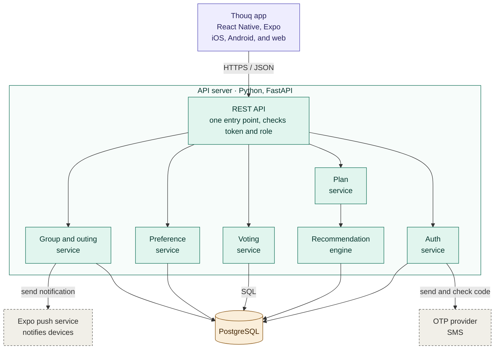

# Thouq · Technical Documentation

Portfolio Project · Stage 3

| | |
|---|---|
| Project | Thouq (ذوق), a group dining planner |
| Team | Shatha Alanzi, Asim Alhubaishi, Hassan Alhuzali, Fahad Almidaj |

## Contents

0. [User stories and mockups](#0-user-stories-and-mockups)
1. [System architecture](#1-system-architecture)
2. Components, classes, and database design (in progress)
3. Sequence diagrams (in progress)
4. API specifications (in progress)
5. SCM and QA plans (in progress)
6. Technical justifications (in progress)

---

## 0. User stories and mockups

### Terms

| Term | Meaning |
|---|---|
| Group | A saved set of people who go out together. It stays after an outing ends. |
| Outing | One occasion inside a group. Each outing has its own preferences, plan, vote, and result. |
| Plan | The list of suggested restaurants for one outing. |
| Registered user | A person with an account (name and phone number). |
| Organizer | The registered user who created the group and runs its outings. |
| Member | A registered user who joined a group. Membership is permanent. |
| Guest | A person without an account who joins one outing with a name only. |
| Participant | An organizer, member, or guest taking part in an outing. |

### Key decisions

The stories below are built on these decisions.

- **Accounts:** Users sign up with their name and phone number and log in with a one-time verification code. There are no passwords.
- **Saved groups:** A member joins a group once. The organizer can start a new outing without re-inviting members.
- **First outing:** Creating a group starts its first outing automatically. The plan, the vote, and the invite link belong to the outing, not to the group.
- **New outings and attendance:** When the organizer starts a new outing in a saved group, every member, including the organizer, receives a notification and confirms whether they are coming. Only those who confirm take part in the plan and the vote. A member who does not respond is not included, but can still confirm until the organizer generates the plan. There are no automatic reminders in the first version.
- **Invite link:** One link per outing, carrying a short invite code. The link opens the app if it is installed; otherwise it opens a web page where a guest can join without installing anything. The code can also be typed in the app. A registered user who joins becomes a permanent group member. A guest joins that outing only. Joining from the link counts as confirming attendance.
- **Web version:** Built from the same code as the mobile app with Expo, and limited to the guest path: joining, entering preferences, viewing the plan, voting, and seeing the result. Registered users use the mobile app.
- **Guests:** Guests have no account, join with a name only, and need a new link for each outing unless they sign up.
- **Group size:** Up to 8 people, including the organizer. When the group is full, a message says so.
- **Preferences:** Editing them for an outing is optional, applies to that outing only, and does not change the account.
- **Allergies:** Shown to the group as a warning only. The app does not filter restaurants by allergens and does not guarantee that a restaurant is safe.
- **Plan:** The organizer generates the plan once participants have entered their preferences.
- **Notifications:** Push notifications are sent when a new outing starts and when the plan is updated. The same information is shown inside the app for anyone who has notifications turned off.
- **Voting:** One vote per person by default. A participant can change their vote until the organizer closes voting. In a tie, the organizer chooses among the tied restaurants.
- **Recommendation:** A rule-based algorithm inside the back-end. It filters places, scores each one by how well it matches every participant, ranks them so that no one is left with a place they rejected, and returns a short, varied list.
- **Restaurant data:** The team's Riyadh restaurants dataset (version 1, prepared 29 September 2026). It is a snapshot and does not update automatically. The app suggests only places marked as open.

### Prioritized user stories

Stories are prioritized with the MoSCoW method: Must Have, Should Have, Could Have, and Won't Have.

#### Must Have

16 stories the app cannot work without.

| # | Title | Role | User story |
|---|---|---|---|
| 1 | Sign up | New user | As a new user, I want to sign up with my name and phone number, so that I can create or join groups and keep my preferences saved. |
| 2 | Log in | Registered user | As a registered user, I want to log in with a verification code sent to my phone, so that I can access my account without a password. |
| 3 | Save preferences | Registered user | As a registered user, I want to save my allergies and preferences, so that I don't have to re-enter them every time. |
| 4 | Create a group | Organizer | As an organizer, I want to create and name a group and start its first outing, so that I can bring people together to decide where to eat. |
| 5 | Invite | Organizer | As an organizer, I want to send an invite link for the outing, so that people can join quickly. |
| 6 | Join a group | Member | As a member, I want to join a group from the invite link, so that I can take part in the decision. |
| 7 | Join as a guest | Guest | As a guest, I want to join an outing from the link using only my name, without an account, so that I can take part quickly. |
| 8 | Outing preferences | Organizer, Member | As an organizer or member, I want to see my saved preferences and edit them for this outing if needed, so that they fit the outing without changing my account. |
| 9 | Guest preferences | Guest | As a guest, I want to enter my allergies and preferences for this outing, so that the group takes them into account. |
| 10 | Track progress | Organizer | As an organizer, I want to see who has joined and who has completed their preferences, so that I know when to generate the plan and when to close voting. |
| 11 | Generate the plan | Organizer | As an organizer, I want to generate restaurant suggestions that match the participants' preferences, with the group's allergies shown as a warning, so that we can choose with everyone's needs in mind. |
| 12 | View the plan | Participant | As a participant, I want to browse the restaurants in the plan, so that I know the options before voting. |
| 13 | Vote | Participant | As a participant, I want to vote for a restaurant from the plan and change my vote until voting closes, so that my opinion counts. |
| 14 | Close voting | Organizer | As an organizer, I want to close voting, so that we can move on to the final decision. |
| 15 | Confirm the winner | Organizer | As an organizer, I want to confirm the winning restaurant, choosing among the tied ones if there is a tie, so that everyone receives the final decision. |
| 16 | See the result | Member, Guest | As a member or guest, I want to see the winning restaurant once the organizer confirms it, so that I know where we are going. |

#### Should Have

11 stories that add real value, but the app works without them.

| # | Title | Role | User story |
|---|---|---|---|
| 17 | Recommendation reason | Participant | As a participant, I want to see why each restaurant was recommended, so that I can trust the suggestion. |
| 18 | Browse restaurants | Registered user | As a registered user, I want to browse restaurants, so that I can see the available options. |
| 19 | Personal plan | Registered user | As a registered user, I want to see suggested restaurants after setting my preferences, so that I know what suits me. |
| 20 | Remove people | Organizer | As an organizer, I want to remove a member or guest, so that only the intended people stay in the group. |
| 21 | Exclude restaurants | Organizer | As an organizer, I want to exclude restaurants from the plan and restore them later, so that I can remove what doesn't suit us without losing it for good. |
| 22 | My groups | Organizer, Member | As an organizer or member, I want to see my saved groups and their outings, so that I can return to them easily. |
| 23 | Start a new outing | Organizer | As an organizer, I want to start a new outing in my saved group, so that we can decide again without re-inviting everyone. |
| 24 | Confirm attendance | Organizer, Member | As an organizer or member, I want to receive a notification when a new outing starts and confirm whether I am coming before the plan is generated, so that the plan and the vote include only the people attending. |
| 25 | Attendance responses | Organizer | As an organizer, I want to see who has confirmed, who has declined, and who has not responded, so that I know who is coming before I generate the plan. |
| 26 | Member notifications | Member | As a member, I want to receive a notification when the plan is updated, so that I don't miss any change. |
| 27 | Restaurant location | Participant | As a participant, I want to open the winning restaurant's location in Google Maps, so that I can get there easily. |

#### Could Have

4 stories to add if time allows.

| # | Title | Role | User story |
|---|---|---|---|
| 28 | Narrow the options | Organizer | As an organizer, I want to reduce the number of suggested restaurants, so that choosing is easier. |
| 29 | Voting settings | Organizer | As an organizer, I want to set whether each person gets one vote or several, so that voting fits how my group decides. |
| 30 | Guest notifications | Guest | As a guest, I want to receive a notification when the plan is updated while the app is closed, so that I don't miss any change. |
| 31 | Sign up after the outing | Guest | As a guest, I want to create an account after the outing, so that I stay in the group without needing a new link each time. |

#### Won't Have

Out of scope for the first version.

- Ordering food or delivery through the app.
- Restaurant reservations.
- Payment options for an outing (splitting the bill, a draw, or one person covering it). Planned for a later version.
- Processing payments or transferring money through the app.
- Filtering restaurants by allergens or guaranteeing that a restaurant is safe.

### Mockups

In progress. The Figma link and screen exports will be added here.

---

## 1. System architecture

Thouq follows a client-server architecture with three layers: a client app (mobile, with a web version for guests), a REST API, and a relational database. External services are used only for sending the login code and for push notifications.

Read the diagram from top to bottom: the app sends every request to the REST API, the API passes it to one service, and the services use the database and the two external services.

- Colours mark the layers: purple for the client, green for the API server, amber for the data layer, and grey with a dashed border for external services.
- Every arrow is a request, and the label says what travels.
- The services are modules of one application, not separately deployed servers.
- All services read and write PostgreSQL. The plan service does so through the recommendation engine and directly when it saves the plan.
- The auth service is the only one that calls the OTP provider.
- The group and outing service sends a notification when a new outing starts; the plan service does the same when the plan is updated.
- The app also opens the winning restaurant's location in Google Maps from a saved link, without going through the server.

### Components

| Component | Layer | Technology | Responsibility |
|---|---|---|---|
| Thouq app | Client | React Native with Expo: iOS and Android apps, and a web version for guests from the same code | All screens; sends requests to the API and shows the results. Holds no shared data and makes no decisions. Opens the winning restaurant's location in Google Maps from a saved link |
| REST API | API server | Python, FastAPI | The only entry point. Checks the token and the user's role, then passes the request to the right service |
| Auth service | API server | Python | Sign-up, login codes, tokens for registered users, and temporary tokens for guests. The only code that talks to the OTP provider |
| Group and outing service | API server | Python | Creating groups and outings, invite codes, joining as a member or guest, attendance, removing people, and the outing's status |
| Preference service | API server | Python | Saved preferences and allergies on the account, and the copy edited for one outing |
| Plan service | API server | Python | Generating the plan on the organizer's request, storing it, excluding and restoring restaurants |
| Recommendation engine | API server | Python | Called by the plan service. Filters and ranks restaurants for an outing and returns a short list with a reason for each place |
| Voting service | API server | Python | Casting and changing votes, closing voting, handling ties, and confirming the winner |
| Database | Data | PostgreSQL | Users, groups, outings, preferences, plans, votes, and the restaurants table |
| OTP provider | External | Chosen before final testing (candidates: Twilio, Authentica) | Sends the verification code by SMS and checks it |
| Push notifications | External | Expo push notification service | Attendance and plan notifications. The back-end sends the message and the recipients' device tokens to Expo, which delivers it to Android and iOS devices |

The restaurants table is filled once from the team's dataset by an import script. The app does not call any external restaurant service at run time.

### Data flow

The app never talks to the database or to the OTP provider directly. Every request goes to the REST API as JSON over HTTPS, and the back-end is the only component that reads and writes the database. The single exception is opening a map link, which needs no data from the server.

**Example: generating the plan**

1. The organizer taps "Generate plan". The app sends the request to the REST API with the organizer's token.
2. The API checks the token, confirms that this user is the organizer of this outing, and passes the request to the plan service.
3. The plan service calls the recommendation engine, which loads the participants' preferences from PostgreSQL.
4. The engine queries the restaurants table, filters and ranks the places, and returns a short list with a reason for each place.
5. The plan service saves the list as the outing's plan and returns it to the app.
6. The other participants' apps receive the plan the next time they ask the API for the outing's state.

**Live updates:** the app asks the API for the current state of the outing every few seconds while a participant is on the plan or voting screen. This keeps the plan and the vote counts up to date without a permanent connection.

**Joining:** every outing has a short invite code, and the invite link carries that code. If the app is installed, the link opens it on the join screen; otherwise it opens the web version in the browser. The code can also be typed in the app. A registered user joins as a member. A guest enters a name only and receives a temporary token that is valid for that outing, which the API accepts for entering preferences, viewing the plan, and voting. The mobile app and the web version call the same API in the same way.

**Notifications:**

1. After login, the app asks the user for permission, obtains a device token from Expo, and sends it to the API, which stores it with the user.
2. When an event needs a notification, such as the organizer starting a new outing or the plan being updated, the responsible service collects the tokens of the members concerned and sends one request to the Expo push service.
3. Expo delivers the notification to each device, even if the app is closed. Tapping it opens the app on the relevant outing.

The same information also appears as a card inside the app, so a member who has turned notifications off, or missed one, still sees it when they open the app. Guests on the web version do not receive push notifications; they see updates on the page.

### Scalability and efficiency

- **Separate layers:** the app, the API, and the database can each be changed or moved to a larger server without rewriting the others.
- **Replaceable parts:** the recommendation engine is called only by the plan service, and the OTP provider only by the auth service, so either can be improved or swapped without changing the app or the other services.
- **Filtering in the database:** restaurants are filtered with SQL queries on indexed columns, so the back-end never loads the full table into memory.
- **Local restaurant data:** suggestions do not depend on a call to an external service, which keeps response time short and predictable.
- **Stored plans:** a plan is generated once per outing and saved, not recalculated every time a participant opens it.
